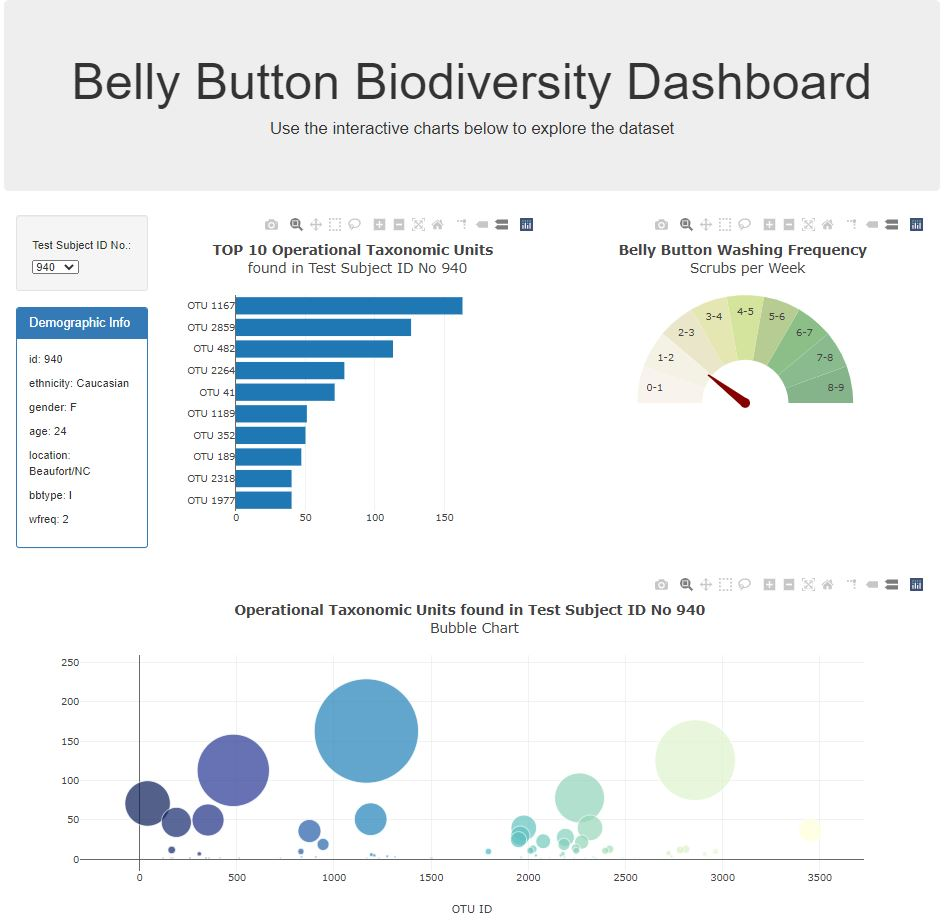

# Belly Button Biodiversity Dashboard
Plotly project for Monash Data Analytics Boot Camp

The purpose of this project was to build an interactive dashboard that dynamically displays the Belly Button Biodiversity dataset.

# Data

There is one key source of data used:

* [samples.json](samples.json) - .json dataset retrieved from [the website ](http://robdunnlab.com/projects/belly-button-biodiversity/results-and-data/)
which catalogs the microbes that colonize human navels

# Analysis

* Use the D3 library to read in `samples.json`.

* Create a dropdown menu which allows user to select sample ID

* Display the selected sample's metadata in a demographic info box

* Create a horizontal bar chart to display the top 10 OTUs found in that individual

* Create a bubble chart that displays each sample

* Create a Gauge Chart to plot the weekly washing frequency of the individual

* Update all of the plots any time that a new sample is selected

  

# Demo

To see the example visit https://mhaszek.github.io/plotly-challenge/.

To run the example locally save the repo, navigate into the repo folder, run `python -m http.server` in command line and visit http://localhost:8000/ in your browser.

# Used Tools
 * JavaScript
 * D3
 * Plotly.js
 * HTML
 * CSS